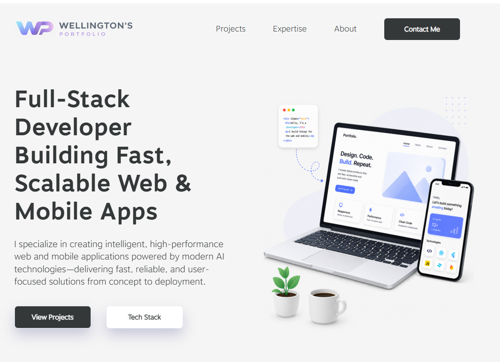

# 🌐 Wellington Web Portfolio

A modern, responsive portfolio website showcasing web design and development projects, skills, and services. Built to highlight professional work, attract clients, and demonstrate technical expertise.

🔗 **Live Site:** [Visit Portfolio](https://wellingtonweb.pages.dev/)

---

## 📌 Overview

This portfolio website presents a collection of web development projects along with information about services, experience, and design approach. It focuses on clean UI, responsiveness, and performance to create a strong online presence.

---

## ✨ Features

* Responsive design (mobile-first)
* Clean and modern UI/UX
* Project showcase / portfolio section
* Service offerings
* Contact section for inquiries
* Fast-loading and optimized performance

---

## 🛠️ Tech Stack

* **Frontend:** React, CSS, JavaScript, Bootstrap, jQuery
* **Framework/Library:** Laravel, Wordpress, Drupal
* **Database:** MySQL
* **Hosting:** Cloudflare, Amazon Web Services
* **Version Control:** Git + GitHub

---

## 📂 Project Structure

```
├── public/
├── src/
├── README.md
```

---

## 🚀 Getting Started

To run locally:

```bash
https://github.com/wellington-wong/wellingtonweb.git
cd wellingtonweb
run command 'npm run start'
```

---

## 🎯 Purpose

This portfolio is designed to:

* Showcase web development projects
* Highlight design and coding skills
* Attract potential clients or employers
* Demonstrate real-world applications
* Communicate services and areas of expertise clearly

---

## 📸 Preview



---

## 📬 Contact

If you’d like to work together or have any questions, feel free to reach out via the website’s contact section.

---

## 📄 License

This project is open-source and available under the MIT License.
